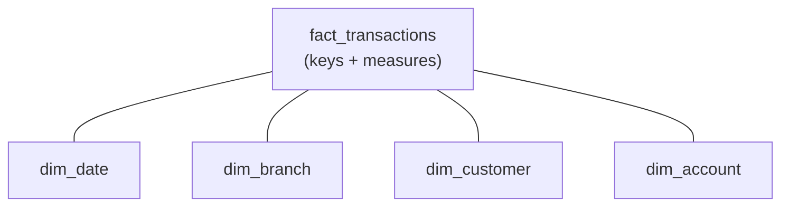
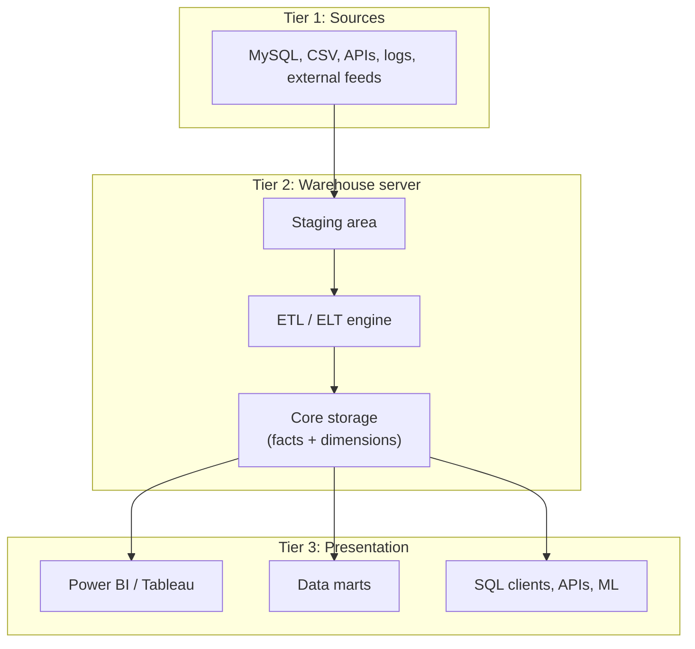

*The full 37-page study guide this post is drawn from is [here as a PDF](/documents/data-warehousing-study-guide.pdf).*

While working through more advanced data analytics, I kept running into the same
wall: everything downstream (dashboards, KPIs, "month-over-month revenue by
region") quietly assumes a data warehouse sits underneath it. So I spent three
days building a proper study guide on data warehousing, from the reason
warehouses exist up to how modern cloud platforms run them.

I didn't use a single resource. I used several AI tools, each for the job it's
best at:

- **Claude** for clear explanations and getting the concepts straight.
- **Gemini + NotebookLM** for organising notes and turning them into reports,
  flashcards, quizzes, mind maps and infographics. This combination is underrated.
- **ChatGPT** for fact-checking, quick definitions and filling gaps.
- **Perplexity** for going deep on a specific technical topic with sources.

The main thing I took away: AI is far more useful as a collaborative study system
than as a search engine. This post is the condensed version of what came out of it.

## The problem a warehouse solves

A MySQL database behind an application is an **OLTP** system (Online Transaction
Processing). It is built for many small, fast operations: insert a row, update a
balance, fetch a customer.

Now an analyst asks: *"What was the month-over-month revenue trend across all
branches for the last three years?"* Running that on the live transactional
database is a disaster. It scans enormous tables, competes with the application
for resources, and runs slowly because the schema was never designed for it.

A data warehouse exists to **separate those two workloads**.

| | OLTP | OLAP |
| --- | --- | --- |
| Purpose | Run the business | Analyse the business |
| Operations | INSERT, UPDATE, DELETE | SELECT (heavy reads) |
| Query style | Simple, row-level | Aggregates across millions of rows |
| Schema | Normalised (3NF) | Denormalised (star / snowflake) |
| Users | Applications, backends | Analysts, BI tools like Power BI |
| Freshness | Real-time | Delayed (batch loaded) |
| Example | A bank recording a transaction | An analyst checking default rates by region |

A warehouse is a separate database built for analytics. Data is **extracted**
from operational systems, **transformed** (cleaned and reshaped), and **loaded**
into it. That's the ETL pipeline, and it's what feeds the warehouse.

## Normalisation and why warehouses break the rules

Normalisation organises a database to remove redundancy: every fact lives in
exactly one place, and tables link to each other by keys.

| Normal form | The rule, simply |
| --- | --- |
| 1NF | Every cell holds one atomic value. No lists in a cell. |
| 2NF | 1NF, plus every non-key column depends on the *whole* composite key. |
| 3NF | 2NF, plus no non-key column depends on another non-key column. |
| BCNF | 3NF, plus every determinant is a candidate key. |
| 4NF | BCNF, plus independent multi-valued facts are split apart. |
| 5NF | 4NF, plus the table can't be split further without losing information. |

The classic summary of 3NF is that every column must depend on *the key, the
whole key, and nothing but the key*.

That is exactly right for an OLTP system, where writes must be fast and correct.
A warehouse wants the opposite trade: it **denormalises** on purpose, accepting
duplicated data so that reads need fewer joins.

| | Normalisation | Denormalisation |
| --- | --- | --- |
| Goal | Integrity, no redundancy | Read speed |
| Tables | Many small ones | Fewer, wider ones |
| Reads | Slower (many joins) | Fast (data already together) |
| Writes | Fast and safe (one place to update) | Slower and riskier |
| Best for | OLTP (banking apps) | OLAP (reporting, dashboards) |

## Star and snowflake schemas

### Star schema

One central **fact table** surrounded by **dimension tables**, which looks like a star.



- The **fact table** records measurable events (transactions, claims, sales):
  foreign keys plus numeric measures. It's narrow in columns and very long in rows.
- **Dimension tables** hold the context: who, what, when, where. They're wide in
  columns, relatively short in rows, and denormalised.

An analogy: the fact table is the receipt; the dimensions are the product
catalogue, store directory and customer profile the receipt refers to.

### Snowflake schema

The same idea, but dimensions are normalised further. `dim_product` points to
`dim_subcategory`, which points to `dim_category`. It saves storage and keeps
integrity clean, but every question needs more joins.

| | Star | Snowflake |
| --- | --- | --- |
| Normalisation | Denormalised, flat dimensions | Fully normalised |
| Query speed | Fast, few joins | Slower, multi-level joins |
| Storage | Higher | Lower |
| Structure | Simple | Branches like a tree |

**Which is better?** "Star is always better" is the wrong answer. Star is
preferred in most cases because query speed and simplicity outweigh storage
savings. Snowflake makes sense when dimension tables are very large, or when
dimension data changes often and you'd otherwise be updating millions of
duplicated rows.

## Facts, in more detail

Facts are classified by whether they can be **summed**:

| Type | Sum across region / product? | Sum across time? | Typical functions | Examples |
| --- | --- | --- | --- | --- |
| Additive | Yes | Yes | `SUM`, `AVG`, `COUNT` | Revenue, claim amount, units sold |
| Semi-additive | Yes | No, use the closing snapshot | `LAST_VALUE`, `AVG`, `MAX` | Account balance, inventory, headcount |
| Non-additive | No | No | `AVG`, `MIN`, `MAX`, `COUNT` | Ratios, percentages, unit price |

A balance of 1,000 on Monday, Tuesday and Wednesday is not 3,000 for the week,
which is why balances are semi-additive. Two products with 10% and 20% margins
don't make a 30% margin, which is why ratios are non-additive.

A **factless fact table** has no measures at all, only keys. A row existing *is*
the fact, and you analyse it with `COUNT()`. It comes in two flavours:

- **Event tables**, such as employee attendance (`date_key`, `employee_key`,
  `facility_key`). Counting rows answers "how many people came to the Chicago
  office in Q3?"
- **Coverage tables**, such as which products were on which promotion in which
  store. Comparing them against actual sales shows the gaps: promoted products
  that sold nothing.

## Dimensions, in more detail

A **dimension** is the noun you slice by (Product, Customer, Store, Date). An
**attribute** is a column inside it (`category`, `brand`, `city`): the thing you
click in a dashboard filter.

| Type | What it is | Example |
| --- | --- | --- |
| Conformed | One dimension shared across many fact tables | A single `dim_date` used by sales, inventory and support |
| Junk | Bundles low-cardinality flags into one table | `is_approved`, `is_emergency`, `claim_channel`, `priority_level` |
| Degenerate | Lives directly in the fact table, no table of its own | Invoice number, claim number |
| Role-playing | One table joined several times under different roles | `dim_date` as order date, ship date and delivery date |
| Slowly changing | Tracks changes to attributes over time | A customer moving city |

Conformed dimensions matter most: they're why marketing's "Q3" matches finance's "Q3".

## Grain: decide it first

The **grain** is the answer to *"what does one row in the fact table represent?"*,
written as one sentence before any column is added.

| Grain | One row is | Used for |
| --- | --- | --- |
| Transactional | One event | Point-of-sale lines, clicks, calls |
| Periodic snapshot | A summary over a fixed period | Daily inventory, monthly balances |
| Accumulating snapshot | A whole process lifecycle | One insurance claim from filing to payout, with a date key per milestone |

Two rules follow from this:

1. **Every dimension and measure must match the grain.** A monthly-store-sales
   fact can't carry `customer_name`. Mixed grain doesn't error; it silently
   double-counts.
2. **You can roll up, but you can't drill down.** Atomic data can always be
   aggregated into weeks or months. Pre-aggregated monthly data can never answer
   "what was our busiest hour last Tuesday?" Prefer the atomic grain.

## Surrogate keys vs natural keys

A **natural key** comes from the source system and means something
(`'PAT-2023-004'`, `'CLM-APL-00892'`). A **surrogate key** is a meaningless
integer the warehouse generates (`patient_sk = 1, 2, 3`).

Natural keys look good enough until a warehouse uses them:

1. **Sources change their keys.** A hospital migrates systems and `PAT-2023-004`
   becomes `MRN-00441`, splitting one patient's history into two identities.
2. **Sources collide.** Apollo, Fortis and Max can all have a patient `1001`.
   Load them with the natural key as primary key and two patients vanish.
3. **String joins are slow.** Joining 500 million fact rows on a `VARCHAR` is
   noticeably slower than joining on an `INT`.
4. **Keys carry business logic.** If a claim-number format changes or resets,
   everything built on it breaks.
5. **SCD Type 2 makes them non-unique.** It needs two rows for the same
   patient, so the natural key can't be the primary key any more.

| patient_sk | patient_id | name | city | valid_from | valid_to |
| --- | --- | --- | --- | --- | --- |
| 1 | PAT-001 | Rahul | Delhi | 2020-01-01 | 2023-06-30 |
| 2 | PAT-001 | Rahul | Mumbai | 2023-07-01 | NULL |

Old claims point at `patient_sk = 1` (Delhi), new ones at `2` (Mumbai), and
history stays intact.

**The rule: use both.** The surrogate key is the primary key and every join. The
natural key stays as an attribute for tracing a row back to its source.
`dim_date` is the one standard exception: its key is usually `YYYYMMDD` as an
integer (`20260524`), so it's readable and sorts chronologically.

## Slowly changing dimensions

| Type | What happens | History kept? | Good for |
| --- | --- | --- | --- |
| 0 | Value is locked | None | Original hire date |
| 1 | Overwrite | None | Fixing typos |
| 2 | Insert a new row with valid-from / valid-to | Full | Customer address, plan changes |
| 3 | Add a "previous value" column | One step back | Comparing current vs last |
| 4 | Move history into a separate table | Full, outside the main table | Attributes that change rapidly |

Type 1 has a trap: if a customer moves from Chicago to Miami and you overwrite,
all their *past* sales suddenly look as if they happened in Miami.

## Data lake, warehouse, lakehouse

| | Data lake | Data warehouse |
| --- | --- | --- |
| Data | Anything, raw | Structured, processed |
| Schema | On read | On write |
| Storage cost | Very cheap (S3, GCS) | Higher |
| Query speed | Slow without extra tooling | Fast |
| Users | Data scientists, ML engineers | Analysts, BI tools |

Each fails in its own way. A lake without governance becomes a **data swamp**.
A warehouse is rigid and can't hold images, logs or free text.

A **lakehouse** combines them: cheap files (Parquet on object storage), plus a
metadata and governance layer, plus a SQL engine, so lake files can be queried
like warehouse tables. Databricks (Delta Lake), Apache Iceberg and Apache Hudi
are the main tools.

Around them sit two smaller pieces:

- **Data marts** are department-scoped slices of the warehouse.
- **Operational data stores (ODS)** show current state (today's numbers, not trends).

## The 3-tier architecture



**Why a staging area instead of transforming straight from the source?**

- Source systems are live, so heavy transforms shouldn't run against them.
- If the ETL fails halfway, staging lets it restart without hitting the source again.
- The raw copy is kept, so a bug in transform logic can be fixed and reprocessed.
- It gives an audit trail of what the raw data looked like.

## Data marts

The warehouse is huge, access needs controlling, and different teams need
different slices. Marts solve all of that.

- **Dependent marts** are built from the central warehouse (sources, then
  warehouse, then mart).
- **Independent marts** are built straight from sources, with no central warehouse.
- **Physical marts** copy the data, so they're faster for heavy use and cost
  more storage.
- **Virtual marts** are views over the warehouse:

```sql
CREATE VIEW finance_mart.fact_claims AS
SELECT *
FROM warehouse.fact_claims f
WHERE f.claim_type IN ('insurance', 'reimbursement');
```

A virtual mart has no storage overhead and is always current, but it's slower at
scale. Conformed dimensions are what let separate marts still agree with each other.

## Inmon vs Kimball

These are the two classic ways to build a warehouse.

- **Inmon (top-down)** builds a normalised enterprise warehouse first and derives
  dependent marts from it. It has a high upfront cost and is very consistent.
- **Kimball (bottom-up)** builds dimensional star-schema marts that deliver value
  early and ties them together with conformed dimensions.

Most real systems today are a **hybrid**: a central, governed layer, with star
schemas on top for the people who query it.

## Indexing and partitioning

| | Indexing | Partitioning |
| --- | --- | --- |
| Idea | A separate lookup map pointing at rows | Physically splits the table into chunks |
| Best for | Finding a needle (a few rows) | Scanning big blocks (a date range) |
| Storage | Grows, since the index is extra data | Doesn't grow |
| Writes | Slower, since every index must be updated | Easier maintenance, since old partitions can be dropped |

The main benefit of partitioning is **partition pruning**. Filter on the
partition column (usually a date) and the engine skips every partition that
can't match. The two work together: partition to cut the search space, index to
find rows inside it.

## ETL vs ELT and the modern cloud stack

| | ETL | ELT |
| --- | --- | --- |
| Transform happens | Outside the warehouse | Inside it, in SQL |
| Tools | Python, Spark, SSIS | SQL, dbt |
| Data loaded | Clean only | Raw first |
| Flexibility | Schema fixed upfront | Raw kept, so data can be re-transformed later |

ELT won in the cloud because platforms like **Snowflake, BigQuery and Redshift**
separate cheap, effectively unlimited storage from elastic compute. Running
transforms inside the warehouse became fast and cheap, so a separate
transformation server stopped making sense. **dbt** is the tool to know here: if
a job description mentions it, the team is doing ELT on a cloud warehouse.

The typical entry-level stack:

```
Source DB (MySQL) → ETL (Python / Airflow) → Warehouse (Snowflake / BigQuery / Redshift) → BI (Power BI)
```

## TL;DR

- OLTP runs the business; the warehouse (OLAP) analyses it.
- Warehouses denormalise on purpose. The star schema (facts plus dimensions) is
  the default.
- Declare the grain first. Prefer atomic. Mixed grain silently double-counts.
- Surrogate keys for joins, natural keys kept for traceability.
- SCD Type 2 is how history survives change.
- Lakes store everything, warehouses store what's analysis-ready, and lakehouses
  try to do both.
- ELT on a cloud warehouse with dbt is the modern default.

## A tip for studying this

Download the [study guide PDF](/documents/data-warehousing-study-guide.pdf), upload
it to NotebookLM, and generate quizzes, flashcards, summaries and mind maps from
it for revision and interview prep. It works surprisingly well for remembering
technical concepts.
