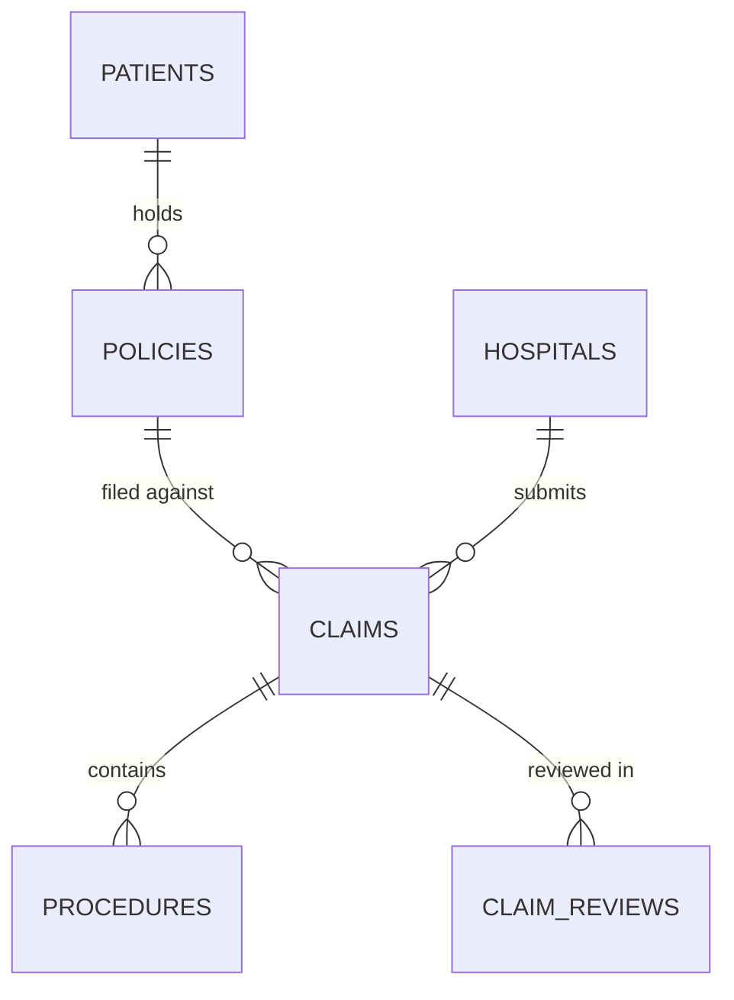
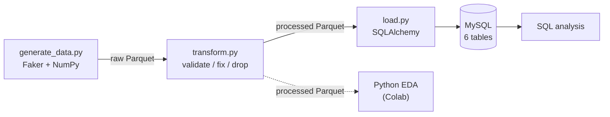

*The full project report is [here as a PDF](/documents/health-insurance-claims-report.pdf), and the code is [on GitHub](https://lnkd.in/g8G96vX7).*

I wanted a project that covers a data analyst's whole workflow, not just the
part where you write queries. That meant designing the database, building the
pipeline that fills it, checking the data is actually valid, and then answering
real business questions in both SQL and Python.

Healthcare insurance claims were a good domain for it. A claim moves through
several stages (patient, policy, claim, procedures, review), the money involved
is skewed, and there are real questions about approvals, denials and profit.

| | |
| --- | --- |
| Domain | Healthcare insurance |
| Data | ~1M+ synthetic rows across 6 tables |
| Database | MySQL |
| Pipeline | Python ETL with Parquet as the intermediate format |
| Libraries | Pandas, NumPy, Faker, SQLAlchemy, PyMySQL, Matplotlib, Seaborn |
| EDA | Google Colab |

## The schema

Six normalised tables model a claim's lifecycle, from registering the patient to
the final decision:

| Table | Rows (approx.) | What it holds |
| --- | --- | --- |
| `patients` | 750,000 | Demographics: date of birth, gender, contact details |
| `hospitals` | 130 | Name, city, state, type (Public / Private / Clinic) |
| `policies` | 300,000 | Type, coverage amount, premium, validity dates |
| `claims` | 300,000 | Amounts, dates, status (Pending / Approved / Denied) |
| `procedures` | 700,000+ | Procedures per claim: category, name, cost, date |
| `claim_reviews` | 50,000 | Decision, reviewer, rejection reason |



A few design decisions made a real difference:

- **No `patient_id` on `claims`.** The patient can be found through
  claim → policy → patient. Storing it twice would risk the two copies
  disagreeing.
- **No `age` column.** Age is calculated from `dob` at query time, so it never
  goes out of date.
- **Phone numbers stored as `VARCHAR`.** A `BIGINT` drops leading zeros, and
  nobody does arithmetic on phone numbers.
- **`city` and `state` as separate columns** on `hospitals`, so regional
  analysis is a simple `GROUP BY`.
- **`rejection_reason` on reviews.** Without it, there's no way to analyse
  denial patterns.
- **`procedure_category` as an `ENUM`** (Surgery, Diagnostic, Therapy,
  Consultation), which keeps the categories clean to aggregate.

## The ETL pipeline

The pipeline is five files, and one command runs the whole thing:

| File | Stage | What it does |
| --- | --- | --- |
| `config.py` | Config | Credentials, file paths, row counts, ENUM values |
| `generate_data.py` | Extract | Generates the synthetic data and writes it to `data/raw/` as Parquet |
| `transform.py` | Transform | Validates and fixes the data, writes to `data/processed/` |
| `load.py` | Load | Reads the processed Parquet and pushes it to MySQL with SQLAlchemy |
| `pipeline.py` | Orchestrator | Runs the three stages in order |



### Making the synthetic data realistic

Purely random data gives you flat, unrealistic distributions. They don't
stress-test the analysis, and every chart looks the same. So the generator uses
real statistical shapes:

- **Claim amounts** follow an exponential distribution (scale 50,000). That's
  right-skewed: most claims are small and a few are very large, like real claims.
- **Procedures per claim** are weighted: 1, 2, 3 or 4 procedures with
  probabilities of 40%, 35%, 20% and 5%.
- **Coverage amounts** depend on the policy type. Critical Illness, for
  example, ranges from Rs. 5,00,000 to Rs. 50,00,000.
- **Names and addresses** use Faker's `en_IN` locale.
- **Phone numbers** have 10 digits and start with 6, 7, 8 or 9, like Indian
  mobile numbers.
- **IDs** are zero-padded with a prefix (`PAT0000001`, `CLM0000001`), so they're
  readable and the same length.
- **Parent IDs are passed down the chain.** Each generator receives the IDs of
  its parent table as input, so every foreign key points at a row that exists.

### Validation: fix or drop

Every data-quality rule falls into one of two groups. If a problem can be fixed
using data already in the row, it gets **fixed**. If the row contradicts itself,
it gets **dropped**.

| Problem | Action | Why |
| --- | --- | --- |
| `approved_amount` > `coverage_amount` | Fix: cap at coverage | Correctable from existing data |
| `procedure_date` before `claim_date` | Fix: set to `claim_date` | A procedure can't come before its claim |
| `review_date` before `claim_date` | Fix: `claim_date` + 1 day | A review can't come before its claim |
| Expired policy with a future `end_date` | Fix: `end_date` = today | Status and dates must agree |
| `claim_date` outside the policy's validity | Drop | No way to tell which date is wrong |
| Invalid ENUM value | Drop | Not recoverable |
| Orphaned foreign key | Drop | Fixing it would mean inventing data |

Deciding this upfront matters. Without a clear rule, bad rows quietly corrupt
every analysis that comes after.

### Idempotency from the start

`load.py` writes with `if_exists='replace'` and loads parents before children.
That means the whole pipeline can be **re-run safely at any time** without
creating duplicates or orphaned rows. Adding that after the fact is much harder
than building it in from the start.

### Why Parquet

At 700,000+ rows, switching from CSV to Parquet made a noticeable difference.
Parquet stores data by column and compresses it, so a query that needs only a
few columns skips the rest entirely. Reads are faster, memory use is lower, and
the files are smaller.

## SQL analysis

Six queries, building from simple aggregations up to window functions:

| # | Business question | SQL used |
| --- | --- | --- |
| Q1 | Approved claim amounts vs total policy coverage | `JOIN`, `SUM`, `MAX`, `GROUP BY` |
| Q2 | How claim statuses are distributed | `GROUP BY`, `COUNT`, `CASE WHEN` |
| Q3 | Procedure categories by volume and approval rate | `JOIN`, `CASE WHEN`, calculated rate |
| Q4 | Hospital rankings within each hospital type | CTE, `RANK() OVER (PARTITION BY)` |
| Q5 | Monthly and quarterly P&L: premiums collected vs claims paid | Chained CTEs, `YEAR`/`QUARTER`/`MONTH`, `NULLIF` |
| Q6 | Most common rejection reasons | `WHERE ... IS NOT NULL`, `GROUP BY`, `ORDER BY` |

### Ranking hospitals within their type

```sql
WITH Hospital_Claims AS (
    SELECT h.name, h.type, COUNT(c.claim_id) AS claims_provided
    FROM claims c
    LEFT JOIN hospitals h ON h.hospital_id = c.hospital_id
    GROUP BY h.name, h.type
)
SELECT name, type, claims_provided,
       RANK() OVER (PARTITION BY type ORDER BY claims_provided DESC) AS ranking
FROM Hospital_Claims;
```

`GROUP BY` alone can't do this. It can count claims per hospital, but it can't
rank each hospital *within its type* and still show every hospital's own row. A
window function with `PARTITION BY` can.

### P&L with chained CTEs

The P&L query uses two CTEs in a row. The first adds up premiums collected and
claims paid by period and policy type. The second builds on the first: it labels
each period as profit or loss and calculates the ratio. Every denominator is
wrapped in `NULLIF(x, 0)`, so a month with no premiums returns `NULL` instead of
crashing the report with a division by zero.

## Python EDA

The same questions, asked again in Python (Google Colab, reading the processed
Parquet files directly):

| Analysis | Method | Finding |
| --- | --- | --- |
| Patient age groups | `pd.cut()` bins | Spread across young adult, adult, middle-aged and senior |
| Claim amounts | `sns.histplot(kde=True)` | Right-skewed, which confirms the generator's exponential distribution |
| Average claim by procedure | `merge` + `groupby` | Surgery is the most expensive; consultation the cheapest |
| Approval rate by gender | `value_counts(normalize=True)` | **Very little difference between genders** |
| Top states by claims | `groupby` + `sort_values` | Claims are concentrated in certain states |
| Monthly trend | `.dt` + line chart | Claim volume over 2018–2024 |
| Processing time by decision | `timedelta` + `groupby` | **Denied claims are reviewed faster than approved ones** |
| High-risk policies | Boolean mask | Flags policies where the approved amount is over 90% of coverage |
| Hospital denial rates | Compared with the mean | Outlier hospitals worth auditing |
| Repeat claimants | Cohort by year | Share of year-1 claimants who came back in year 2 |

The three headline insights:

1. **Claims are right-skewed**, which matches how real insurance data behaves.
2. **Approval rates barely differ by gender**, so there's no sign of bias there.
3. **There's an inefficiency in processing times**: denied claims get decided
   faster than approved ones.

## What I learned

- **SQL's logical execution order** is `FROM → JOIN → WHERE → GROUP BY → HAVING →
  SELECT → ORDER BY`. Knowing that explains most confusing SQL errors: why a
  `SELECT` alias doesn't work in `WHERE`, and why aggregates belong in `HAVING`.
- **Window functions and `GROUP BY` answer different questions.** `GROUP BY`
  collapses rows into one per group. Window functions compute over a group and
  keep every row.
- **Chained CTEs read like steps.** Each one is named and can be tested on its
  own, which beats deeply nested subqueries.
- **Wrap denominators in `NULLIF()`.** A single zero denominator can break an
  entire report.
- **Use vectorised operations in pandas.** `pd.cut()` bins 750,000 ages in
  milliseconds; a Python loop over the rows would take minutes.

## Next steps

- A Power BI dashboard: regional claims, policy types, hospital performance and
  five-year P&L.
- Fraud detection using statistical outliers in claim amounts and denial rates.
- Scheduling the pipeline daily with Apache Airflow.
- Moving to the cloud: Parquet on AWS S3, MySQL on Amazon RDS.
