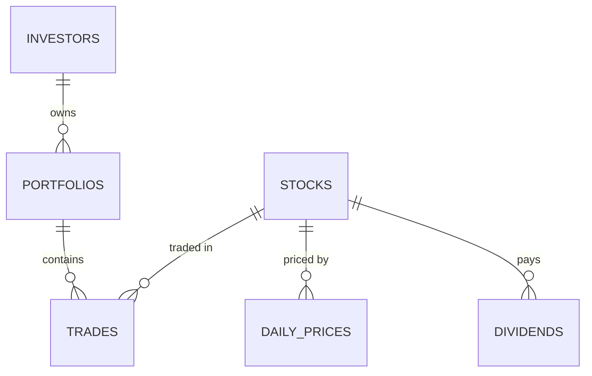

*The full project report is [here as a PDF](/documents/stock-portfolio-report.pdf), and the code is [on GitHub](https://lnkd.in/gH8UkEGz).*

Over a few weeks I built a relational database in MySQL that models a real
investment platform: investors, their portfolios, the trades they make, daily
market prices and dividends. I then wrote 12 analytical queries against it,
grouped into three tiers of difficulty.

The goal was to practise SQL on the kind of questions a fintech data analyst
actually gets asked. How much capital is deployed? What's the realised profit on
this trade? Who was owed a dividend?

## The schema

Six normalised tables:

| Table | Primary key | Foreign keys | Holds |
| --- | --- | --- | --- |
| `investors` | `investor_id` | — | Platform users |
| `portfolios` | `portfolio_id` | `investor_id` | Accounts owned by investors |
| `stocks` | `stock_id` | — | Tradeable equities |
| `trades` | `trade_id` | `portfolio_id`, `stock_id` | Every BUY and SELL (the main fact table) |
| `daily_prices` | `price_id` | `stock_id` | Historical OHLCV prices |
| `dividends` | `dividend_id` | `stock_id` | Dividend payouts, with ex-dates |



The design follows a **star schema**, as financial databases usually do. The
high-volume event tables (`trades`, `daily_prices`) are the **fact tables**, and
the descriptive ones (`investors`, `portfolios`, `stocks`) are the
**dimensions**.

Some deliberate choices:

- **`trade_type` is an `ENUM('BUY','SELL')`.** A `VARCHAR` would accept "buy",
  "Buy " or anything else.
- **`DATE` rather than `DATETIME`** for trade, price and ex-dates. Storing a
  time on date-only data wastes space and makes comparisons awkward.
- **`UNIQUE (stock_id, price_date)`** on `daily_prices`, so the same stock can't
  have two prices on the same day.
- **Indexes on `trade_date`, `portfolio_id` and `price_date`**, so the biggest
  tables aren't scanned in full.
- **Foreign keys live on the child table.** A trade without a portfolio means
  nothing, while a stock is complete on its own.

## The data: synthetic users, real prices

| Table | Rows | Source |
| --- | --- | --- |
| `investors` | 50 | Faker (`en_IN`) |
| `portfolios` | 80 | Faker (`en_IN`) |
| `stocks` | 15 | Real tickers, hard-coded |
| `trades` | 500 | Faker + random |
| `daily_prices` | ~11,000 | **yfinance (real data)** |
| `dividends` | ~50 | Faker + random |

The 15 stocks are split across **NSE and NASDAQ**. Their prices are real
historical OHLCV data from **January 2022 to December 2024**, pulled with
yfinance. Combining synthetic users with real prices means the price analysis
(moving averages, trends) reflects actual market behaviour, while no real
person's data is involved.

## Tier 1: joins and aggregations

**Capital invested per portfolio (assets under management):**

```sql
SELECT p.portfolio_id, p.portfolio_name,
       ROUND(SUM(t.quantity * t.price_per_share) + SUM(t.fees), 2) AS total_invested
FROM portfolios p
JOIN trades t ON p.portfolio_id = t.portfolio_id
WHERE t.trade_type = 'BUY'
GROUP BY p.portfolio_id;
```

**BUY and SELL counts side by side.** Conditional aggregation puts both counts
on the same row, which `GROUP BY trade_type` can't do:

```sql
SELECT i.full_name,
       COUNT(CASE WHEN t.trade_type = 'BUY'  THEN 1 END) AS buy_trades,
       COUNT(CASE WHEN t.trade_type = 'SELL' THEN 1 END) AS sell_trades
FROM investors i
JOIN portfolios p ON i.investor_id = p.investor_id
JOIN trades t     ON p.portfolio_id = t.portfolio_id
GROUP BY i.investor_id, i.full_name;
```

**Current position sizes.** BUYs count as positive, SELLs as negative, and
`HAVING` removes positions that have been fully sold:

```sql
SELECT p.portfolio_id, s.ticker,
       SUM(CASE WHEN t.trade_type = 'BUY'  THEN  t.quantity
                WHEN t.trade_type = 'SELL' THEN -t.quantity END) AS shares_held
FROM trades t
JOIN portfolios p ON p.portfolio_id = t.portfolio_id
JOIN stocks s     ON s.stock_id = t.stock_id
GROUP BY p.portfolio_id, s.stock_id
HAVING shares_held > 0;
```

This tier also includes the five most-traded stocks by volume and the total fees
paid per investor.

## Tier 2: subqueries and CTEs

**Portfolios above the platform average.** A nested subquery totals each
portfolio, then averages those totals to get one benchmark number:

```sql
SELECT p.portfolio_id,
       ROUND(SUM(t.quantity * t.price_per_share), 2) AS total_invested
FROM portfolios p
JOIN trades t ON p.portfolio_id = t.portfolio_id
GROUP BY p.portfolio_id
HAVING total_invested > (
    SELECT AVG(portfolio_total) FROM (
        SELECT SUM(quantity * price_per_share) AS portfolio_total
        FROM trades GROUP BY portfolio_id
    ) AS sub
);
```

**Realised P&L on every sale.** If someone bought the same stock several times
at different prices, a simple average of those prices is wrong. The correct cost
basis is the **weighted average**, `SUM(quantity × price) / SUM(quantity)`:

```sql
WITH avg_buy_cost AS (
    SELECT portfolio_id, stock_id,
           SUM(quantity * price_per_share) / SUM(quantity) AS avg_buy_price
    FROM trades
    WHERE trade_type = 'BUY'
    GROUP BY portfolio_id, stock_id
)
SELECT t.portfolio_id, s.ticker,
       ROUND((t.price_per_share - a.avg_buy_price) * t.quantity - t.fees, 2) AS net_pnl
       -- plus a CASE WHEN labelling each row PROFIT / LOSS / BREAK EVEN
FROM trades t
JOIN avg_buy_cost a ON a.portfolio_id = t.portfolio_id
                   AND a.stock_id     = t.stock_id
JOIN stocks s       ON s.stock_id     = t.stock_id
WHERE t.trade_type = 'SELL';
```

**Dividend income, respecting the ex-date.** You only receive a dividend if you
held the shares *before* the ex-date. The CTE nets BUYs against SELLs, counting
only trades made before each ex-date:

```sql
WITH holdings AS (
    SELECT t.portfolio_id, t.stock_id, d.dividend_id,
           SUM(CASE WHEN t.trade_type = 'BUY'  THEN t.quantity ELSE 0 END)
         - SUM(CASE WHEN t.trade_type = 'SELL' THEN t.quantity ELSE 0 END) AS shares_held
    FROM trades t
    JOIN dividends d ON d.stock_id = t.stock_id
    WHERE t.trade_date < d.ex_date
    GROUP BY t.portfolio_id, t.stock_id, d.dividend_id
    HAVING shares_held > 0
)
SELECT i.full_name,
       ROUND(SUM(h.shares_held * d.amount_per_share), 2) AS dividend_income
FROM holdings h
JOIN portfolios p ON p.portfolio_id = h.portfolio_id
JOIN investors i  ON i.investor_id  = p.investor_id
JOIN dividends d  ON d.dividend_id  = h.dividend_id
GROUP BY i.investor_id;
```

## Tier 3: window functions

A window function calculates across a group of rows **without collapsing them**
into one. The pattern is `FUNCTION() OVER (PARTITION BY … ORDER BY … ROWS BETWEEN …)`:

- `PARTITION BY` sets the group.
- `ORDER BY` sets the order of rows within the group.
- `ROWS BETWEEN` sets how many rows the calculation looks at.

| Function | Query | Business use |
| --- | --- | --- |
| `RANK()` | Stocks ranked by volume within each sector | Sector leaderboard |
| `SUM() OVER` | Running total invested per portfolio | When capital was deployed |
| `AVG() OVER` + `ROWS` | 7-day moving average price | Smoothing out daily noise |
| `NTILE(4)` | Investors split into quartiles | Segmentation (Standard to Platinum) |

**7-day moving average on real prices:**

```sql
SELECT s.ticker, dp.price_date, dp.close_price,
       ROUND(AVG(dp.close_price) OVER (
           PARTITION BY dp.stock_id
           ORDER BY dp.price_date
           ROWS BETWEEN 6 PRECEDING AND CURRENT ROW
       ), 2) AS moving_avg_7day
FROM daily_prices dp
JOIN stocks s ON s.stock_id = dp.stock_id
ORDER BY s.ticker, dp.price_date;
```

`6 PRECEDING AND CURRENT ROW` makes a 7-row window. For the first few days, when
fewer than 7 rows exist, MySQL averages whatever rows are available instead of
failing.

**Running total per portfolio.** This uses the same pattern, with the window set
to `ROWS BETWEEN UNBOUNDED PRECEDING AND CURRENT ROW`.

**Investor tiers with `NTILE(4)`:**

```sql
WITH investor_totals AS (
    SELECT i.investor_id, i.full_name,
           ROUND(SUM(t.quantity * t.price_per_share), 2) AS total_invested
    FROM trades t
    JOIN portfolios p ON p.portfolio_id = t.portfolio_id
    JOIN investors i  ON i.investor_id  = p.investor_id
    GROUP BY i.investor_id
)
SELECT full_name, total_invested,
       NTILE(4) OVER (ORDER BY total_invested) AS quartile,
       CASE NTILE(4) OVER (ORDER BY total_invested)
           WHEN 1 THEN 'Standard' WHEN 2 THEN 'Silver'
           WHEN 3 THEN 'Gold'     WHEN 4 THEN 'Platinum'
       END AS investor_tier
FROM investor_totals
ORDER BY total_invested DESC;
```

`RANK()` gives tied rows the same rank and then skips the next one (1, 1, 3), so
the sector leaderboard stays honest when two stocks are tied.

## What I learned beyond the syntax

**`WHERE` vs `HAVING` is about more than execution order.** `WHERE` filters
*data*: individual rows, before any aggregation exists. `HAVING` filters
*insights*: the aggregated results. Any condition involving `SUM`, `COUNT` or
`AVG` belongs in `HAVING`.

**Window functions don't replace `GROUP BY`.** They answer a different question.
`GROUP BY` asks "what is the total per group?" A window function asks "what is
this row's place within its group?" Running totals, rankings and moving averages
need both the individual row and its group at the same time.

## Errors I hit along the way

Learning to read MySQL's error codes is part of learning SQL. These are the ones
I ran into and how I fixed them:

| Code | Error | Cause | Fix |
| --- | --- | --- | --- |
| 1054 | Unknown column | Typo in a column or table name | Check it exists in the referenced table |
| 1052 | Ambiguous column | The same column name in two joined tables | Prefix it: `table.column` |
| 1055 | `ONLY_FULL_GROUP_BY` | Selected column not grouped or aggregated | Add it to `GROUP BY` or aggregate it |
| 1064 | Syntax error | Missing keyword, comma or bracket | Check the structure; a CTE must be followed by a `SELECT` |
| 1066 | Not unique table/alias | Same table joined twice without aliases | Add aliases |
| 1109 | Unknown table in field | CTE or subquery alias out of scope | Define the CTE before the `SELECT` that uses it |
| 1111 | Invalid group function | Nested aggregate like `MAX(SUM())` | Pre-aggregate in a subquery or CTE |
| 1140 | Non-aggregated column | Mixing aggregated and plain columns | Add `GROUP BY`, or use a window function |

## Wrapping up

The three tiers follow the progression a data analyst goes through: basic
aggregation, then business logic in CTEs, then window-function analytics. The
patterns here apply directly to fintech and financial data roles: weighted cost
basis for P&L, ex-date-aware dividend income, moving averages on real market
data, and NTILE segmentation.
